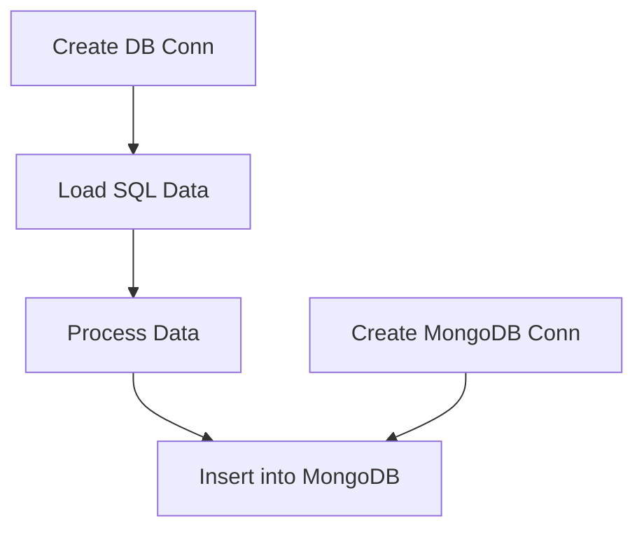

# SQL2MongoDB

 

## DESCRIPTION

Idea is to create a Pipeline to transfer data from regular SQL databases to MongoDB.
 

## Current Situtation

Currently only handles SQLite. 
However there's some redundant, or lets say unnecesary code, will remove in future. 
(some sections of Datapipline, as this can be handeled through pd.read_sql_table, pd.read_sql_query, pd.read_sql)
 

## Pipeline

 

## FUTURE WORK

- Exception handling
- Code rework (Majorly OOP's)
- Implement/replicate relations b/w tables (if possible)
- More to come...
 

## Lib versions

- Python 3.10.5
- pip 22.1.2
- pandas 1.4.3
- pymongo 4.1.1
