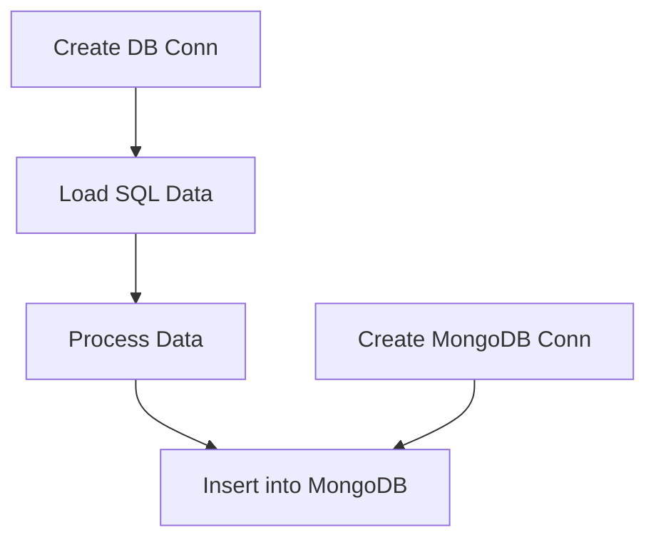

# SQL2MongoDB

 

## DESCRIPTION

 
Idea is to create a Pipeline to transfer data from regular SQL datbases to MongoDB.
 

## Current Situtation

 
Currently only handles SQLite. 
However there's some redundant, or lets say unnecesary code, will remove in future. 
(some sections of Datapipline, as this can be handeled through pd.read_sql_table, pd.read_sql_query, pd.read_sql)
 

## Pipeline

